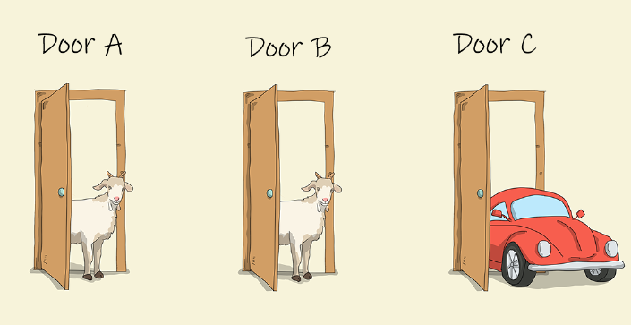

# Monty Hall Problem Game

This repo contains files for Monty Hall Problem.

## Online Demo

https://stuon.github.io/js-monty-hall-problem/

## The Monty Hall Problem

The Monty Hall problem is a statistical brainteaser and is based on a challenge from an old game show called “let’s make a deal” and named after it’s host, Monty Hall.

In the game show, the contestant is given three doors to choose from. Behind one door is a car, and behind the other two are goats. The host knows in advance what is behind each door. Once the contestant has chosen a door, the host will open one of the remaining doors that has a goat, then ask the contestant if he/she wants to switch to the remaining door.

Is it better for the contestant to switch or stay with their original choice?

At first glance, it might seem that there is no advantage to switching, as showing the door with a goat will leave only two doors left unopened. Since you know one is a goat and the other the car, the odds sound like 50/50?

It’s a bit un-intuitive, but you will actually have a higher chance of winning the car if you switch. Not a 1 in 2 chance of winning, but actually 2 out of 3 chance. If you don’t switch, then you will only win 1 in 3 times.

Not convinced? Have a play with the demo at https://stuon.github.io/js-monty-hall-problem/. You can also use the 1000x simulate to compare the two results.

## So why is this so?

Well let’s look at the first scenario of not switching. If you pick a random door from the three. And behind one door is a car, whilst the others are goats, you will have a 1 in 3 chance of winning the car. Ie number_of_cars / number_of_doors

Now let’s look at the second scenario of switching. When you choose a door at the start, you have a 1 in 3 chance of picking the car. Or from the other side, it also means you have a 2 in 3 chance of picking the goat. Think about this for a bit, as it’s important for the next part for the explanation. If you pick a goat, then the host will open another door with the second goat, which means the last unopened door will be a car. So if you switch, the odds of picking the car is the odds that you picked the goat in the first selection. Ie 2 in 3.

## Diagram

Let’s assume the door looks like below and play through all the possible actions you can do.

| Door 1 | Door 2 | Door 3 |
| ------ | ------ | ------ |
| goat   | goat   | car    |

### Not switching

| Door 1 | Door 2 | Door 3 | Strategy    | OutCome |
| ------ | ------ | ------ | ----------- | ------- |
| goat   | goat   | car    | Pick Door 1 | Lose    |
| goat   | goat   | car    | Pick Door 2 | Lose    |
| goat   | goat   | car    | Pick Door 3 | Win     |

So out of the 3 possibilities, you can only win in 1 of them. So you have a 1 in 3 chance of winning.

### Switching

| Door 1 | Door 2 | Door 3 | Strategy                                                    | Outcome |
| ------ | ------ | ------ | ----------------------------------------------------------- | ------- |
| goat   | goat   | car    | Pick door 1. Host shows Door 2. You switch to Door 3        | Win     |
| goat   | goat   | car    | Pick door 2. Host shows Door 1. You switch to Door 3        | Win     |
| goat   | goat   | car    | Pick door 3. Host shows Door 1 or 2. Regardless, you switch | Lose    |

In this method, you can win in 2 of the possibilities. So you have a 2 in 3 chance of winning.

While the example above assumes the door started with “goat | goat | car”.
you can will get same results if it was “car | goat | goat” or “goat | car | goat”.

## FAQ

### Q1: How do I download the files?

A: If you are new to github and just want to download the complete package, hit the green button saying "Clone or download", and choose "Download Zip" option, and you're good to go.

### Q2: How do I run the application?

A: Once downloaded, just run click on the index.html file to open it up in your favour browser
